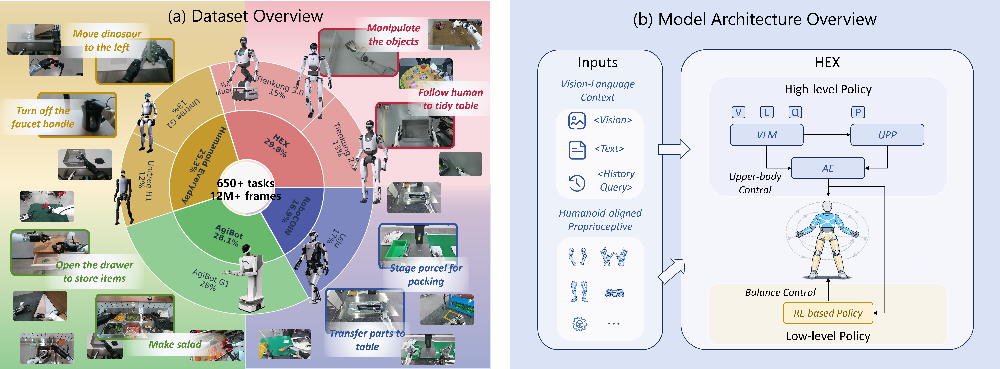

<h1 align="center">HEX: Humanoid-Aligned Experts for Cross-Embodiment Whole-Body Manipulation</h1>

<div align="center">

<a href="https://arxiv.org/abs/2604.07993">
  
</a>
<a href="https://hex-humanoid.github.io/">
  
</a>
<a href="https://huggingface.co/X-Humanoid/HEX-Model">
  
</a>
<a href="https://huggingface.co/datasets/X-Humanoid/HEX-Datasets">
  
</a>

</div>

<br>

<p align="center">
  
</p>

HEX is a whole-body vision-language-action framework for full-sized humanoid robots. It combines a Qwen-VL backbone, a Unified Proprioceptive Predictor (UPP), and a flow-matching action head to predict continuous future actions.
The key idea of HEX is to align heterogeneous humanoid states into shared body-part slots and learn predictive body dynamics from cross-embodiment humanoid data. This enables the policy to transfer across different humanoid platforms and perform long-horizon whole-body manipulation.
During deployment, HEX directly predicts arm, hand, and waist actions, while providing high-level commands to a low-level RL-based whole-body controller for generating leg actions. This design enables coordinated and stable humanoid manipulation.

## News

- ✅ **2026/10/04** Optimize the pretraining and fine-tuning code.
- ✅ **2026/10/01** Release improved model checkpoints with better performance.
- ✅ **2026/09/18**: All pretraining and fine-tuning datasets for HEX have been released.
- ✅ **2026/05/17**: The pretraining and fine-tuning code for HEX has been released.

  
## Installation

First, git clone this repo and `cd` into it.

```bash
# clone project
git clone https://github.com/Open-X-Humanoid/HEX.git
cd HEX
```

Then create python/pytorch env.

```bash
# crerate conda environment
conda create -n hex python=3.10 -y
conda activate hex

# Install env dependencies
sudo apt update
sudo apt install libegl1-mesa-dev libglu1-mesa

# Install requirements
pip install -r requirements.txt

# Install FlashAttention2
pip install flash-attn --no-build-isolation

# Install HEX
pip install -e .
```

If `flash-attn` fails to install correctly, you can run

```bash
python hex/utils/test_flash_attn.py
```

to check the versions of PyTorch, CUDA, and the libstdc++ ABI.
Then, manually download a compatible wheel from the [flash-attn release](https://github.com/Dao-AILab/flash-attention/releases).
We use version 2.7.3. However, for newer GPUs (e.g., NVIDIA RTX 5090), you should install the latest available release (e.g., version 2.8.3) to ensure compatibility.
Example:

```bash
wget https://github.com/Dao-AILab/flash-attention/releases/download/v2.7.3/flash_attn-2.7.3+cu12torch2.6cxx11abiFALSE-cp310-cp310-linux_x86_64.whl
pip install flash_attn-2.7.3+cu12torch2.6cxx11abiFALSE-cp310-cp310-linux_x86_64.whl
```


## Quick Start

We release the pretrained HEX checkpoint and provide an improved checkpoint trained with a refined data mixture, where lower-quality data sources are down-weighted, on [Hugging Face](https://huggingface.co/X-Humanoid/HEX-Model). 

| Description | Params | Link |
|:-----------:|:------:|:----:|
| HEX | 2.4B | 🤗 [HEX-model](https://huggingface.co/X-Humanoid/HEX-Model) |

### Download HEX Checkpoints

To download the HEX checkpoint, first modify the target download path in [`hex/utils/download_model_hex.py`](hex/utils/download_model_hex.py), and then run:

```bash
python hex/utils/download_model_hex.py
```

### Download the Base VLM

Before running inference, please also download the Qwen3-VL base model:

```bash
python hex/utils/download_model_qwen.py
```

After downloading Qwen3-VL, update the `framework.qwenvl.base_vlm` field in the `config.yaml` file of the downloaded HEX checkpoint to your local Qwen3-VL path.

### Run Inference

Once both the HEX checkpoint and the Qwen3-VL model are prepared, follow [`notebooks/eval_model.ipynb`](notebooks/eval_model.ipynb) to run model inference.


### Data

We release all processed datasets used by HEX on 🤗 [Hugging Face](https://huggingface.co/datasets/X-Humanoid/HEX-Datasets). The released data have already been converted into the format used by HEX and can be directly used for pretraining, fine-tuning, and evaluation without additional preprocessing.

The dataset repository is organized into two main subsets:

- `pretrain/`: processed multi-embodiment datasets used for HEX pretraining.
- `eval/`: real-world task datasets used for fine-tuning and evaluation.

The overall structure is:

```text
HEX-Datasets/
├── pretrain/
│   ├── agibot/
│   ├── g1/
│   ├── h1/
│   ├── leju/
│   ├── tiangong2/
│   ├── tiangong3/
│   └── tianyi/
├── eval/
│   ├── dvt217_carry_boxes_and_avoid_obstacles/
│   ├── dvt217_carry_boxes_follow_human/
│   ├── dvt217_imitate_posture/
│   ├── dvt217_pour_wine_follow_the_finger/
│   ├── dvt217_turn_around_and_carry_boxes/
│   ├── evt12_carry_box_and_tidy_table/
│   ├── evt12_put_cube_in_box/
│   ├── evt12_tidy_table/
│   ├── evt2_40_pick_up_box/
│   ├── evt2_40_pick_up_toy/
│   └── ...
└── eval_others/   # deprecated
```

> **Note:** `eval_others/` is a legacy directory and is no longer used in the current HEX evaluation pipeline.

To download the released datasets, run:

```bash
bash scripts/download_datasets.sh
```

See the README files under each active subset for more detailed dataset descriptions.


<details>
<summary><b>Original data sources and preprocessing</b></summary>

HEX is trained on data collected from multiple humanoid embodiments and public datasets. The original data sources are listed below.

| Embodiment / Platform | Source | Dataset |
|:----------------------|:-------|:--------|
| Tiangong Series | HEX | 🤗 [HF Link](https://huggingface.co/datasets/X-Humanoid/HEX-Datasets) |
| Unitree G1 | [Humanoid Everyday](https://arxiv.org/abs/2510.08807) | 🤗 [HF Link](https://huggingface.co/datasets/USC-PSI-Lab/Humanoid-Everyday-G1) |
| AgiBot-to-Unitree G1 | [AgiBot World Colosseo](https://arxiv.org/abs/2503.06669) & [TrajBooster](https://arxiv.org/abs/2509.11839) | 🤗 [HF Link](https://huggingface.co/datasets/l2aggle/Agibot2UnitreeG1Retarget) |
| Unitree H1 | [Humanoid Everyday](https://arxiv.org/abs/2510.08807) | 🤗 [HF Link](https://huggingface.co/datasets/USC-PSI-Lab/Humanoid-Everyday-H1) |
| Leju Kuavo | [RoboCOIN](https://arxiv.org/abs/2511.17441) | 🤗 [HF Link](https://huggingface.co/collections/RoboCOIN/robocoin) |

The released HEX datasets follow the LeRobot v2.1 data format. Each dataset therefore requires a corresponding `modality.json`.

These preprocessing steps are only required when reconstructing the datasets from the original sources. The processed datasets released in 🤗 [X-Humanoid/HEX-Datasets](https://huggingface.co/datasets/X-Humanoid/HEX-Datasets) can be used directly.

</details>


### Data Collection

Due to commercial restrictions, we are unable to release the data collection pipeline used for the Tiangong series robots.

For users interested in collecting data on Unitree G1, we recommend referring to the following open-source data collection pipelines:

- [OpenTrajBooster](https://github.com/OpenHelix-Team/OpenTrajBooster), which uses a VR headset and handheld joysticks for full-body teleoperation.
- [Psi0](https://github.com/physical-superintelligence-lab/Psi0/tree/main/real): uses a PICO VR headset with controllers, along with a waist tracker and foot trackers for full-body teleoperation.


## Pretraining

You can download our [pretrained HEX model](https://huggingface.co/X-Humanoid/HEX-Model) and skip this step if you only want to run inference, fine-tuning, or evaluation.

Before pretraining, download the Qwen3-VL backbone:

```bash
bash scripts/download_models.sh
```

Then, configure the following fields in [`scripts/pretrain_hex.sh`](scripts/pretrain_hex.sh):

- `base_vlm`: path to the downloaded Qwen3-VL backbone.
- `data_root_dir`: path to the local pretraining dataset directory.
- `dataset_name`: dataset mixture used for pretraining.

The dataset root is automatically exposed through `HEX_PRETRAIN_DATA_ROOT`, so no source-code modification is required.

Finally, start pretraining with:

```bash
bash scripts/pretrain_hex.sh
```

Other training settings can be directly adjusted in `scripts/pretrain_hex.sh`.


## Fine-tuning

After obtaining the [pretrained HEX model](https://huggingface.co/X-Humanoid/HEX-Model), you can further fine-tune HEX on downstream tasks using the released evaluation datasets.

Configure the following fields in [`scripts/fine_tune_hex.sh`](scripts/fine_tune_hex.sh):

- `base_vlm`: path to the Qwen3-VL backbone.
- `data_root_dir`: path to the local evaluation dataset directory.
- `dataset_name`: downstream task used for fine-tuning.
- `pretrained_models_path`: path to the pretrained HEX checkpoint.

Then, start fine-tuning with:

```bash
bash scripts/fine_tune_hex.sh
```

Other training settings can be directly adjusted in `scripts/fine_tune_hex.sh`.

## Depolyment

Due to commercial restrictions, the RL-based low-level whole-body controller used for the Tiangong series robots is not open-sourced. However, we provide a sample real-world deployment interface in [`examples/real_world`](examples/real_world), together with the corresponding deployment scripts:

Deploy the HEX policy on the server:

```bash
bash scripts/deploy_server.sh
```

Run the HEX client on the robot side:

```bash
bash scripts/deploy_client.sh
```

If you want to deploy your own model on Unitree G1, you may refer to the following open-source projects:

- [OpenTrajBooster](https://github.com/OpenHelix-Team/OpenTrajBooster): uses [HOMIE](https://github.com/InternRobotics/OpenHomie) as the low-level RL-based whole-body controller.
- [Psi0](https://github.com/physical-superintelligence-lab/Psi0/tree/main/real): uses [AMO](https://github.com/OpenTeleVision/AMO) as the low-level RL-based whole-body controller.

When training your own low-level controller, please make sure that the command space output by the high-level VLA policy matches the input space expected by the low-level controller. The dataset construction process should also follow the same interface for consistent training and deployment.


## Simulation

Thanks to the cross-embodiment capability of VLA models, HEX can also be evaluated in simulation environments such as LIBERO.

First, download the LIBERO datasets:

```bash
python hex/utils/download_dataset_libero.py --base_dir /your/dataset/path
```

Then, replace the `modality.json` file for each LIBERO suite with the provided template in [examples/LIBERO/modality.json](examples/LIBERO/modality.json).

Next, modify the following fields in [`scripts/libero/train_hex_libero.sh`](scripts/libero/train_hex_libero.sh):

- `base_vlm`: path to your Qwen3-VL backbone
- `dataset_name`: name of the LIBERO dataset mixture
- `data_root_dir`: path to your local LIBERO dataset directory

Then start training with:

```bash
bash scripts/libero/train_hex_libero.sh
```

For evaluation, modify the following fields in [`scripts/libero/eval_libero.sh`](scripts/libero/eval_libero.sh):

- `ckpt_root`: root directory of the trained checkpoint
- `ckpt_path`: relative path to the checkpoint file

Then run:

```bash
bash scripts/libero/eval_libero.sh
```


## Citation

```
@article{bai2026hex,
  title={HEX: Humanoid-Aligned Experts for Cross-Embodiment Whole-Body Manipulation},
  author={Bai, Shuanghao and Li, Meng and Lv, Xinyuan and Wang, Jiawei and Wang, Xinhua and Liao, Fei and Hou, Chengkai and Gu, Langzhe and Zhou, Wanqi and Wu, Kun and others},
  journal={arXiv preprint arXiv:2604.07993},
  year={2026}
}
```

## Ackwnledgemments

This project draws inspiration from and builds upon several notable open-source projects, including: [StarVLA](https://github.com/starVLA/starVLA), [Isaac-GR00T](https://github.com/NVIDIA/Isaac-GR00T), [HiMoE-VLA](https://github.com/ZhiyingDu/HiMoE-VLA), [LeRobot](https://github.com/huggingface/lerobot), [Humanoid Everyday](https://github.com/physical-superintelligence-lab/Humanoid-Everyday), [RoboCOIN](https://github.com/FlagOpen/RoboCOIN), [AgiBot-World](https://github.com/OpenDriveLab/AgiBot-World), and [OpenTrajBooster](https://github.com/OpenHelix-Team/OpenTrajBooster).